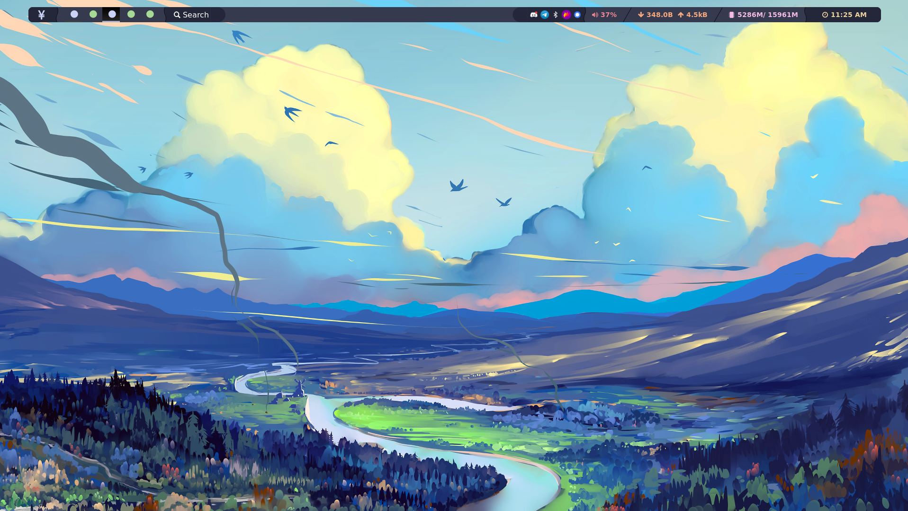
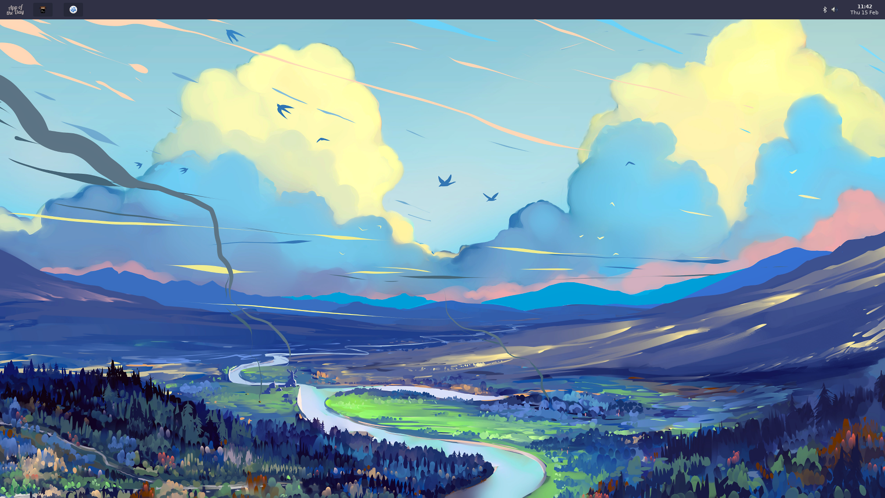

# Wittano NixOS configuration

Personal repository configuration, packages and Nix related staff. Repository is fully support [flake](https://nixos.wiki/wiki/Flakes) and you can use packages or template in your configs:

- Packages
```nix
    inputs.wittano-repo.url = "github:Wittano/nix-dotfiles"
    ...

    # Actually, repository support only Linux x86 architecture
    inputs.wittano-repo.packages.x86_64-linux.<pkg_name>
```
List of packages you can find in [pkgs directory](./pkgs/README.md). Also, repository has own [cachix](https://app.cachix.org):
```nix
nixConfig = {
    trusted-substituters = [
        "https://wittano-nix-repo.cachix.org"
    ];
    extra-trusted-public-keys = [
        "wittano-nix-repo.cachix.org-1:SqjGwMsbzVQOXhbS90DXFC7AoGH99dzPy8zixK3cyt0="
    ];
};
```  

- Templates
```bash
    nix flake init --template github:Wittano/templates#<template_name>
```
List of avaiable templates you can find in [templates directory](./templates/README.md)

- NixOS configuration

Reposiotry contain 3 profiles with "dev" version. Dev version of profile is additation version of profile, that create mutable configuration for a few configuration e.g. qtile. It make easy updating configuration without rebuilding whole system or config.

Avaiable NixOS profiles are:
- pc - default and main configuration for my NixOS system. There are a few desktop configuration:
    - qtile 
    - openbox 
    - bspwm 
- laptop - configuration for my private laptop
- vm - testing configuration for VM